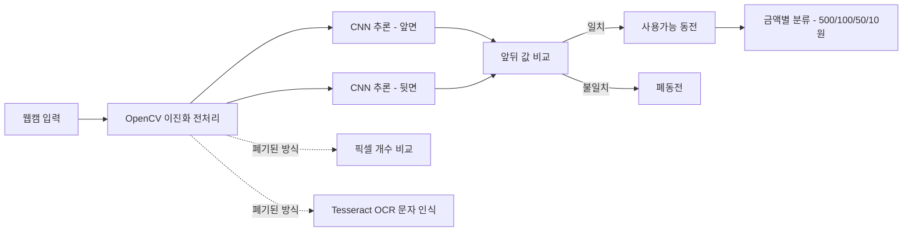
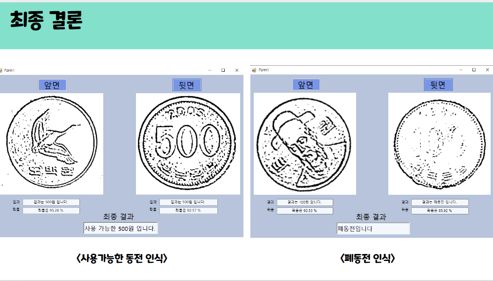
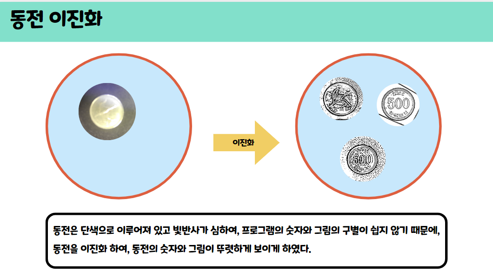

# 동전 판별기 (Coin Classifier · CNN 94.60%)
> 유통 중 훼손·오염 동전과 정상 동전을 자동 판별·분류하는 딥러닝 기반 비전 시스템

## 📌 프로젝트 정보
| 항목 | 내용 |
|------|------|
| 개발 기간 | 2025.11.08 ~ 2025.12.12 |
| 팀 구성 | 3인 팀 프로젝트 |
| 담당 역할 | 전체 설계 및 구현 |
| 시연 영상 | 준비 중 |

## 🎯 프로젝트 개요
시중에 유통되는 동전 중 훼손·오염된 폐동전과 정상 동전을 자동으로 구별하고 금액별로 분류하는 시스템입니다. 단색 표면과 빛 반사로 패턴 구별이 어려운 동전의 특성을 해결하기 위해, **이진화 전처리 → Tesseract OCR → 딥러닝(CNN)** 순으로 접근 방식을 단계적으로 발전시켰습니다. 각 방식의 한계를 실험으로 분석하며 최적의 기법을 도출했고, 최종적으로 CNN 모델을 통해 **94.60%의 판별 정확도**를 달성했습니다.

## ✨ 주요 기능 / 담당 업무
- **동전 이진화 전처리**: 단색·빛 반사로 패턴 구별이 어려운 동전을 OpenCV 이진화로 세부 패턴을 추출하고, 폐동전의 패턴 미검출 원인을 분석했습니다.
- **픽셀 기반 판별 한계 분석**: 백색 픽셀 개수 비교 방식을 시도했으나 조명에 따른 편차로 신뢰성 확보에 실패했으며, 이를 통해 방식 전환의 근거를 확보했습니다.
- **Tesseract OCR 문자 인식 시도**: OCR로 동전의 발행 연도·금액 문자를 인식하려 했으나 빛 반사·글자 깨짐으로 정형화된 문자 외에는 인식이 불가능했고, 이로써 딥러닝 채택의 근거를 확보했습니다.
- **CNN 동전 판별 모델 구축**: 500·100·50·10원 앞·뒷면을 다양한 각도·조명에서 이진화 촬영해 학습 데이터셋을 구성하고, 최종 100원 판별 정확도 94.60%를 달성했습니다. 앞·뒷면 값이 일치하면 사용가능, 불일치하면 폐동전으로 분류하는 판별 로직을 구현했습니다.
- **C# WinForms 판별 GUI 개발 보조 및 발표 자료 제작**: 판별 결과를 사용자에게 시각적으로 제공하는 데스크톱 GUI 개발을 보조하고 프로젝트 발표 자료를 제작했습니다.

## 🛠 기술 스택
### Software
- Python
- OpenCV (이진화 전처리)
- Tesseract OCR
- 딥러닝 CNN
- C# WinForms

### Hardware
- 웹캠

## 🔀 시스템 아키텍처

웹캠으로 입력된 동전 영상을 이진화 전처리한 뒤 앞·뒷면 각각 CNN으로 추론하고, 두 값의 일치 여부로 사용가능 동전과 폐동전을 구분하며, 사용가능 동전은 금액별로 분류합니다. 초기에 시도한 픽셀 비교·OCR 방식은 신뢰성 한계로 폐기되었습니다.

## 📸 스크린샷
> `images/` 폴더에 이미지를 추가한 뒤 아래 경로를 맞춰주세요.

| 화면 | 설명 |
|------|------|
|  | 이진화 전처리로 추출한 동전 세부 패턴 |
|  | CNN 판별 결과 및 금액별 분류 GUI |

## 🎬 시연 영상

