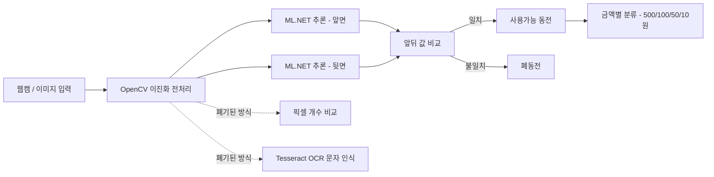

# 동전 판별기 (Coin Classifier · ML.NET 이미지 분류 94.60%)
> 유통 중 훼손·오염 동전과 정상 동전을 자동 판별·분류하는 딥러닝 기반 비전 시스템


## 📌 프로젝트 정보
| 항목 | 내용 |
|------|------|
| 개발 기간 | 2025.11.08 ~ 2025.12.12 |
| 팀 구성 | 3인 팀 프로젝트 |
| 담당 역할 | 딥러닝 계산, C# WinForms Form 제작, OpenCV·Tesseract 문자 인식 |
| 시연 영상 | 준비 중 |

## 🎯 프로젝트 개요
은행에서 훼손·오염된 폐동전을 분류하는 작업에는 많은 시간이 소요되며, 동전의 크기·모양으로 금액을 분류하는 기계는 있어도 **표면 상태로 폐동전을 가려내는** 시스템은 없습니다. 본 프로젝트는 실시간 카메라 영상을 이진화하여, 마모·오염·녹으로 훼손된 폐동전과 사용 가능 동전을 자동으로 구별하는 시스템을 제작했습니다.

동전은 단색 표면과 빛 반사로 패턴 구별이 어렵기 때문에, **이진화 전처리 → Tesseract OCR → 픽셀 개수 비교 → 딥러닝(ML.NET 이미지 분류)** 순으로 접근 방식을 단계적으로 발전시키며 각 방식의 한계를 실험으로 분석했습니다. 최종적으로 ML.NET 이미지 분류 모델을 통해 **100원 판별 정확도 94.60%**를 달성했고, 앞·뒷면 추론 결과의 일치 여부로 사용 가능 동전과 폐동전을 판정합니다.

## ✨ 주요 기능 / 담당 업무
- **딥러닝 동전 판별 모델 구축 (담당)**: 500·100·50·10원 앞·뒷면을 다양한 각도·조명에서 이진화 촬영해 학습 데이터셋을 구성하고, ML.NET 이미지 분류(전이학습 기반) 모델을 학습시켰습니다. 5-Fold 교차검증으로 정확도를 평가했으며 100원 판별 정확도 94.60%를 달성했습니다.
- **판별 로직 구현 (담당)**: 앞·뒷면을 각각 추론해 두 결과가 일치하면 사용가능, 불일치하면 폐동전으로 분류하는 판정 로직을 구현했습니다.
- **C# WinForms GUI 제작 (담당)**: 이미지를 입력받아 추론 모델을 호출하고, 예측 결과와 확률(Score)을 사용자에게 시각적으로 보여주는 데스크톱 GUI를 제작했습니다.
- **OpenCV·Tesseract 문자 인식 시도 (담당)**: OpenCV 이진화로 추출한 숫자·문자를 Tesseract OCR로 실시간 인식하려 했으나, 단색·빛 반사로 인한 글자 깨짐으로 한계를 확인하고 방식 전환의 근거를 확보했습니다.

## 🛠 기술 스택
### Software
- C# / .NET (WinForms)
- ML.NET — Image Classification (전이학습 기반 이미지 분류)
- OpenCV (이진화 전처리)
- Tesseract OCR

### Hardware
- 웹캠 (실시간 영상 입력)

## 🔀 시스템 아키텍처

웹캠으로 입력된 동전 영상을 이진화 전처리한 뒤 앞·뒷면 각각을 ML.NET 이미지 분류 모델로 추론하고, 두 값의 일치 여부로 사용가능 동전과 폐동전을 구분하며, 사용가능 동전은 금액별로 분류합니다. 초기에 시도한 픽셀 비교·OCR 방식은 신뢰성 한계로 폐기되었습니다.

## 💻 핵심 코드 (담당 역할)

### 1. WinForms GUI — 이미지 입력 및 추론 결과 표시
이미지를 선택받아 ML.NET 추론 모델을 호출하고, 예측 결과와 확률(Score)을 정렬해 가장 높은 확률을 화면에 출력합니다. (`CoinTestGO/Form1.cs`)
```csharp
private void Result(string _adress)
{
    var input = new ModelInput()
    {
        ImageSource = _adress
    };
    ModelOutput result = ConsumeModel.Predict(input);

    // Score 배열을 내림차순 정렬해 최상위 확률을 추출
    float ex_temp;
    for (int i = 0; i < result.Score.Length; i++)
    {
        for (int j = 1; j < result.Score.Length; j++)
        {
            if (result.Score[i] < result.Score[j])
            {
                ex_temp = result.Score[j];
                result.Score[j] = result.Score[i];
                result.Score[i] = ex_temp;
            }
        }
    }

    textBox2.Text = $"확률은 {result.Score[0] * 100:N2} % ";
    textBox3.Text = $"결과는 {result.Prediction} 입니다. ";
}
```

### 2. 학습 파이프라인 — ML.NET 이미지 분류
원본 이미지 바이트를 Feature로 변환하고 `ImageClassification` 트레이너로 다중 분류 모델을 구성합니다. 별도 검증셋이 없어 5-Fold 교차검증으로 정확도를 측정했습니다. (`CoinTestGOML.ConsoleApp/ModelBuilder.cs`)
```csharp
public static IEstimator<ITransformer> BuildTrainingPipeline(MLContext mlContext)
{
    // 라벨 매핑 + 이미지 원본 바이트를 Feature로 로드
    var dataProcessPipeline = mlContext.Transforms.Conversion.MapValueToKey("Label", "Label")
        .Append(mlContext.Transforms.LoadRawImageBytes("ImageSource_featurized", null, "ImageSource"))
        .Append(mlContext.Transforms.CopyColumns("Features", "ImageSource_featurized"));

    // 이미지 분류 트레이너
    var trainer = mlContext.MulticlassClassification.Trainers.ImageClassification(
            new ImageClassificationTrainer.Options() { LabelColumnName = "Label", FeatureColumnName = "Features" })
        .Append(mlContext.Transforms.Conversion.MapKeyToValue("PredictedLabel", "PredictedLabel"));

    return dataProcessPipeline.Append(trainer);
}

private static void Evaluate(MLContext mlContext, IDataView trainingDataView, IEstimator<ITransformer> trainingPipeline)
{
    // 단일 데이터셋을 5-Fold 교차검증해 정확도 지표 산출
    var crossValidationResults = mlContext.MulticlassClassification.CrossValidate(
        trainingDataView, trainingPipeline, numberOfFolds: 5, labelColumnName: "Label");
    PrintMulticlassClassificationFoldsAverageMetrics(crossValidationResults);
}
```

### 3. 추론 엔진 — 학습된 모델 로드 및 예측
학습된 모델(.zip)을 한 번만 로드해 `PredictionEngine`을 지연 생성(Lazy)하고, 재사용하여 예측합니다. (`CoinTestGOML.Model/ConsumeModel.cs`)
```csharp
private static Lazy<PredictionEngine<ModelInput, ModelOutput>> PredictionEngine =
    new Lazy<PredictionEngine<ModelInput, ModelOutput>>(CreatePredictionEngine);

public static ModelOutput Predict(ModelInput input)
{
    ModelOutput result = PredictionEngine.Value.Predict(input);
    return result;
}
```

## 🔧 기술적 도전과 해결 (Technical Challenges)

### Q1. 단색 동전의 패턴을 어떻게 인식할 것인가?
> **Challenge:** 동전은 단색 표면에 빛 반사가 심해, OpenCV로 최대한 정확하게 이진화하더라도 패턴이 일부 깨져 Tesseract OCR이 동전의 숫자·문자를 제대로 인식하지 못했습니다.
>
> **Solution:** OCR로 문자를 직접 읽는 방식의 한계를 실험으로 확인하고, 문자 인식 대신 이진화된 동전 패턴 전체를 학습하는 딥러닝(ML.NET 이미지 분류) 방식으로 전환했습니다.

### Q2. 조명에 따라 결과가 달라지는 픽셀 비교 방식의 한계
> **Challenge:** 딥러닝 난이도가 높아 먼저 이진화된 동전의 흰색 픽셀 개수를 세어 개수가 비슷하면 같은 동전으로 판단하는 방식을 시도했으나, 빛에 따라 픽셀 개수가 천차만별로 달라져 신뢰성 확보에 실패했습니다.
>
> **Solution:** 조명 편차에 취약한 픽셀 비교 방식을 폐기하고, 다양한 구도·빛 반사·회전 각도로 촬영·이진화한 이미지를 학습 데이터로 구성해 조명 변화에 강건한 딥러닝 모델을 구축했습니다.

### Q3. 학습 데이터가 적은 상황에서 정확도를 어떻게 신뢰할 것인가?
> **Challenge:** 동전 이미지 데이터셋의 규모가 작아 학습용·검증용 데이터를 따로 나누기 어려웠고, 단일 학습 결과만으로는 모델 정확도를 신뢰하기 어려웠습니다.
>
> **Solution:** 단일 데이터셋을 5-Fold 교차검증(CrossValidate)으로 평가해 평균 정확도와 표준편차·신뢰구간을 함께 산출했습니다. 또한 동전을 여러 각도로 회전·다양한 조명에서 촬영해 데이터 다양성을 확보, 최종 100원 판별 정확도 94.60%를 달성했습니다.

## 📸 스크린샷

| 화면 | 설명 |
|------|------|
|  | WinForms 판별 GUI — 동전 앞·뒷면 이진화 이미지와 확률·결과를 표시하며, 사용가능 동전 인식과 폐동전 인식 결과를 비교 |
|  | 동전 이진화 전처리 — 빛 반사로 패턴이 보이지 않던 원본을 이진화해 500원 등 동전의 숫자·그림을 또렷하게 변환 |

## 🎬 시연 영상
> 준비 중
